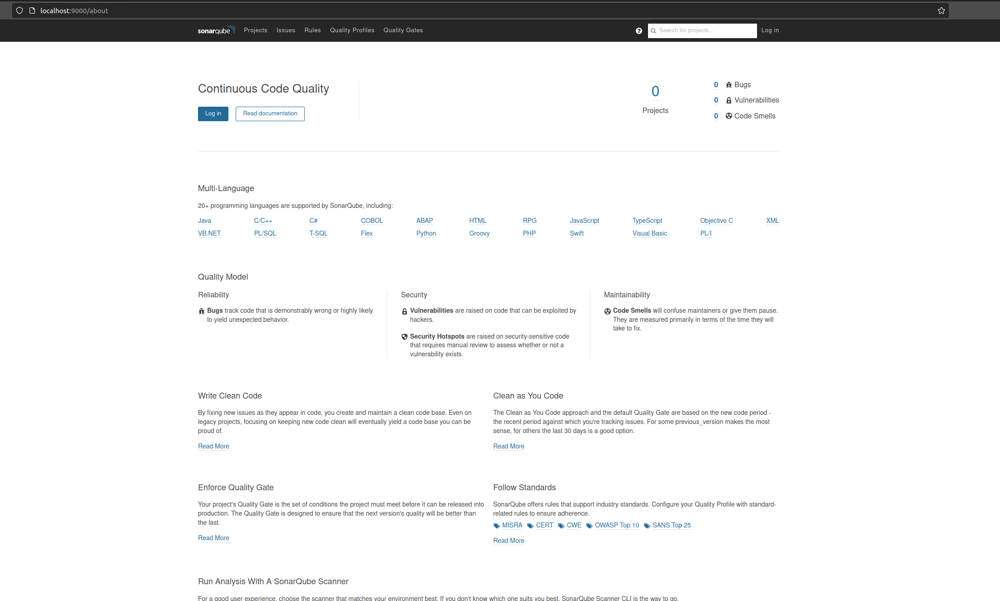
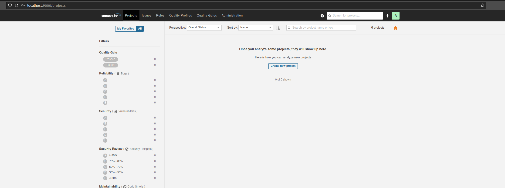
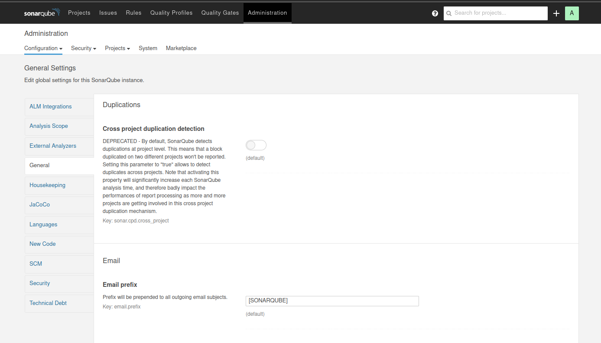
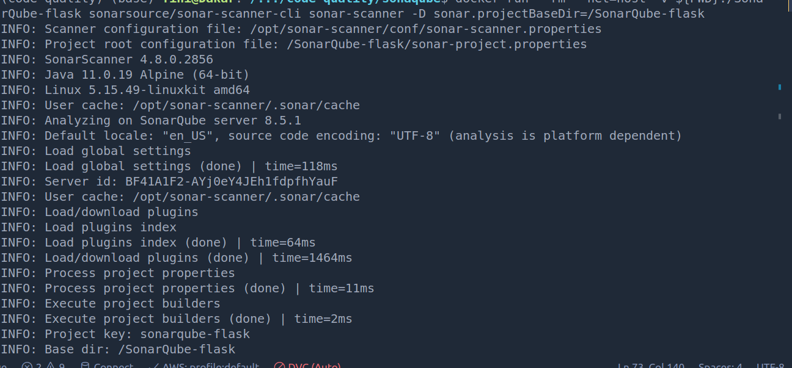
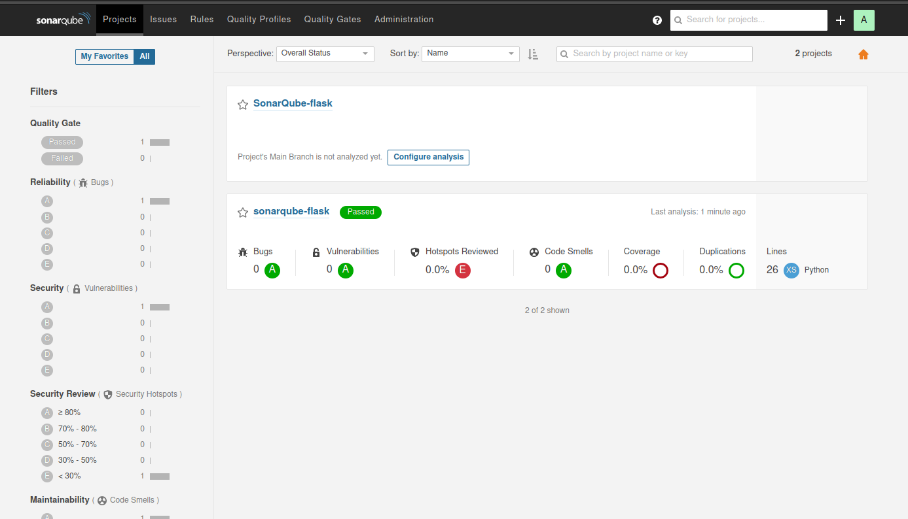

# SonarQube

In this project we want to cover the following using docker.

- Overview of Sonarqube and where to use it.
- Setup/Install Sonarqube.
- Configure python project in Sonarqube.
- Configure Jenkins with Sonarqube for automated testing.

The inspiration for this projects came from this wornderful [Progress Story blog](https://progressstory.com/tech/step-by-step-configuration-of-sonarqube-with-jenkins-for-python/) which served as the foundation.

## Prerequisites

- Docker and docker compose
- Pipenv

The files for this project are located in the gitbub repository. Clone the repository and navigate to _sonaqube_ directory. 

To start the service run

```sh
docker compose up -d
```
SonarQube is running port 9000 as specified in the docker-compose file. To access it, navigate to `localhost:9000` amd observe something like the one show below. .

In the yaml file, we added credentials. Use these credentials to login. .  For security purposes, it is recommended to generate a new and stronger password. This is achieved by going to __A->account->security->security__. Another security tip is to disable annonymous data access to our system. Go to __Administration->Security__ and selecting __Force user authentication__ at the bottom of the page.

## Getting Notified

It is possible to setup notifications. This can be particularly useful if we have a CICD pipeline and we want to be notified when the code quality fails.__Notification__ via emails can be achieved by going to __A->account->notifications__ select desired statu then go to __Administration->General__ and add the following

Email Client setup in Sonarqube. 

Enter below values

```txt
email prefix: [SONARQUBE]
from address: <your email address>
from name: SonarQube
SMTP Configuration
    host: smtp.gmail.com
    password: <your password>
    port: 587
username: <your username>
server base URL: https://localhost:9000(your sonarqube domain)
```

Generated a token sonar-token

```txt
sonar-scanner \
  -Dsonar.projectKey=SonarQube-flask \
  -Dsonar.sources=. \
  -Dsonar.host.url=http://localhost:9000 \
  -Dsonar.login=685734605d81dbf2f906ac274a7a3340ecb3a81b
```

## Sonar And python environment config

Generate a token via __A->account->security. We also need a project which will be scanned. I called in _SonarQube-flask_. Select token and python. There will be an option to install SonarQube but we b will use docker for our sonar-scanner.

Create a _sonar-project.properties_ file on the root directory. This file will have all the flags or properties of the sonar scanner of that project

```txt
sonar.projectKey=sonarqube-flask
sonar.projectBaseDir=/sonarqube-flask
sonar.sources=.
sonar.host.url=http://localhost:9000
sonar.login=e21546a01f24a02b82428c8fe2d3622a5bd0fd8a
sonar.python.coverage.reportPaths=/sonarqube-flask/coverage.xml
sonar.python.xunit.reportPath=/sonarqube-flask/result.xml
sonar.coverage.dtdVerification=false
sonar.inclusions=app.py
sonar.coverage.exclusions=**/__init__.py
```


Set the environment via

```sh
pipenv install
pipenv shell
pipenv install -r requirements.txt
```

## Execution of Sonar Scanner on Project

Considering that you are in the root folder of the project and with the python files _app.py_ and _test.py_, you are ready to go with running the code. Inside the local python development environment, run the command

```sh
py.test --cov-report xml:coverage.xml --cov=. --junitxml=result.xml  test.py
```

These generated _coverage.xml_ and _result.xml_ files.

Now, we want to run the startic analysis and view in the SonarQube UI. We can achived this, for linux via

To run the project locally, I ran

```sh
 docker run --rm --net=host -v ${PWD}:/SonarQube-flask sonarsource/sonar-scanner-cli sonar-scanner -D sonar.projectBaseDir=/SonarQube-flask
```

Here is what my terminal and UI looks like. 

. 

## Setup Jenkins Server
