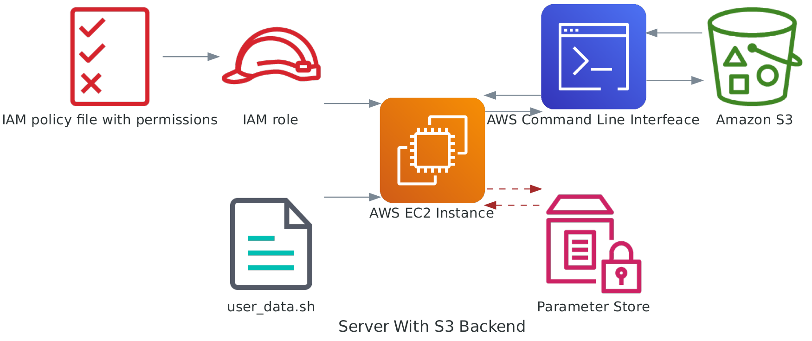

# Infrastructure

This README provides information on how to provision a basic infrastructure in AWS using Terraform. Terraform is a powerful tool for infrastructure configuration and management. To set up the infrastructure, follow the steps outlined below.

## Prerequisites

Before getting started, ensure that you have Terraform installed on your local machine. If you don't have it already, you can refer to the [official Terraform installation guide](https://developer.hashicorp.com/terraform/tutorials/aws-get-started/install-cli) for instructions tailored to your operating system.

## Description of Infrastructure

The infrastructure consists of an EC2 instance for compute and an S3 bucket for artifact storage. Refer to the diagram below for a visual representation of the infrastructure:



_Image by author. [See](../images/diagram_ec2_s3.py)_

## Requirements

To create the necessary infrastructure, you will need to perform the following tasks:

1. Create a VPC.
2. Create an Internet Gateway and attachto the VPC.
3. Configure a public subnet for the EC2 instance.
4. Set up a public route table.
5. Define a security group for the EC2 instance.
6. Launch an EC2 instance.
7. Create I am role to access an S3 bucket and attach to EC2.
7. Verify the setup to ensure everything is functioning correctly.

Additionally , you will need to provide a bucket name for artifact storage. The bucket should be provided in the __iamrole_ec2_s3.tf_ file. You can find the relevant configuration in the `iamrole_ec2_s3.tf` file on line 4.

Furthermore, it's important to generate a private and public key-pair, which are necessary for SSH connectivity testing once the infrastructure is built. To generate the key-pair in Ubuntu 22.04, use the following command from the root directory of the Terraform project, `compute-server-storage`:

```bash
ssh-keygen -t rsa -b 4096 -m pem -f demo_kp && openssl rsa -in demo_kp -outform pem && chmod 400 demo_kp.pem
```

## Provisioning

To provision the infrastructure in AWS, ensure that the correct AWS profile is set. For detailed instructions on setting AWS profiles locally, refer to the AWS documentation. Basically you need to create an access key pair and run the command `aws configure`. A terminal will open for you to provide the access key id and secret key id. 

 By default, the script assumes the use of the default profile, which is a good security practice to avoid exposing credentials. Keep in mind that this demo infrastructure has been designed for access from a single IP address. In the future, it can be modified to allow access from multiple IPs and integrate with Active Directory.
 
Add you have added the IP address in file `secrets.tfvars`, execute the following commands:

```sh
terraform init # downloads the necessary plugins for the project
terraform plan -var-file=secrets/secrets.tfvars# identifies the necessary changes, including infrastructure to be provisioned
terraform apply -var-file=secrets/secrets.tfvars # deploys the services in AWS
```

To connect to the EC2 instance, use the following SSH command (note the IP):

```sh
ssh -i "demo_kp" ec2-user@$ip-address
```

If this doesn't work try

```sh
ssh -o 'IdentitiesOnly yes' -i "demo_kp" ec2-user@ip-address

```

If you successfully connect to the Linux server, you have completed the setup process.

## Installing Tools

After connecting to the server, you may want to install additional tools. One of the necessary tools is Anaconda Python, which can be installed according to your requirements.

## Expanding Team Connectivity

To expand team connectivity beyond a single person, further configuration steps are required. This section will be updated in the future to provide detailed instructions on how to achieve this.

## Clean Up

If you are here for learning purposes and wants to destroy your infrastructure, you can simply run
`terraform apply -destroy -var-file=secrets/secrets.tfvars -auto-approve`
