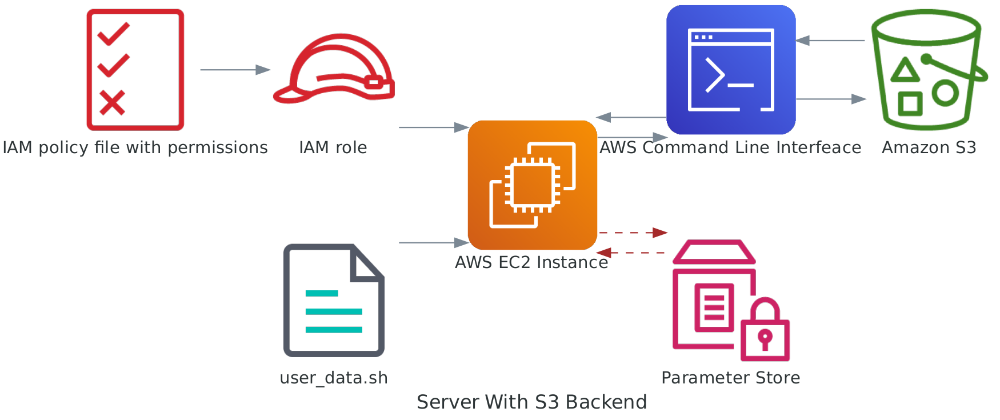

# Provisioning Basic Infrastructure in AWS Using Terraform

## Why Terraform?

When I embarked on writing a series of posts about transitioning from proprietary software like SAS to open-source solutions, I quickly realized the importance of carefully setting up the infrastructure. As I delved deeper into the topic, I decided to enhance my knowledge in machine learning operations by enrolling in the MLOPS ZoomCamp. My goal was to provide comprehensive insights and guides in the transition process.

During this journey, I experienced the constant need to manually create and manage cloud resources through the console. It became frustrating to discover that I had forgotten to delete certain resources, resulting in unnecessary costs. That's when I discovered Terraform, and it completely transformed my approach.

With Terraform, I can effortlessly create and destroy cloud resources without worrying about leaving behind forgotten instances or services in various regions. It offers the flexibility and peace of mind that allows me to focus on my posts and content creation, rather than constantly monitoring and managing infrastructure.

So here I am, excited to share my first post about infrastructure, empowered by the capabilities of Terraform. It has become an essential tool in my journey towards seamless and efficient infrastructure management.

Are you looking to provision a basic infrastructure in AWS using Terraform? Look no further! In this blog post, we will guide you through the steps required to set up an infrastructure consisting of an EC2 instance for compute and an S3 bucket for artifact storage. By following these instructions, you'll have your infrastructure up and running in no time.

## Prerequisites

Before we dive into the Terraform code, make sure you have the following prerequisites in place:

1. **AWS Account**: Sign up for an AWS account if you don't have one already. You'll need your AWS access key and secret key for Terraform to interact with AWS resources.
2. **Terraform**: Install Terraform on your local machine. You can download the latest version from the official [Terraform website](https://developer.hashicorp.com/terraform/tutorials/aws-get-started/install-cli).

## Description of Infrastructure

Let's start by understanding the infrastructure we will be building. Our infrastructure will include an EC2 instance for compute and an S3 bucket for artifact storage. Take a look at the diagram below for a visual representation:



_Image by author. [See](../images/diagram_ec2_s3.py)_

## Step-by-Step Guide

To provision the necessary infrastructure, follow these steps:

1. **Create a VPC**: Start by creating a Virtual Private Cloud (VPC) to isolate your resources.
2. **Set up an Internet Gateway**: Attach an Internet Gateway to the VPC to enable internet connectivity.
3. **Configure a public subnet**: Create a public subnet within the VPC to host your EC2 instance.
4. **Create a public route table**: Define a public route table to allow traffic in and out of the subnet.
5. **Define a security group**: Set up a security group to control inbound and outbound traffic for the EC2 instance.
6. **Launch an EC2 instance**: Provision an EC2 instance within the public subnet.
7. **Copy user data to EC2**: Copy the user data to the EC2 and install the programs.
8. **Create an IAM role**: Set up an IAM role that allows the EC2 instance to access the S3 bucket.
9. **Verify the setup**: Ensure everything is functioning correctly by performing a verification of the infrastructure.

During the provisioning process, you will be prompted to provide a bucket name for artifact storage. Make sure to include the bucket name in the `iamrole_ec2_s3.tf` file on line 4.

Additionally, generate a private and public key-pair to establish SSH connectivity with the EC2 instance. You can use the following command in Ubuntu 22.04 to generate the key-pair from the root directory of your Terraform project, `compute-server-storage`:

```bash
ssh-keygen -t rsa -b 4096 -m pem -f demo_kp && openssl rsa -in demo_kp -outform pem && chmod 400 demo_kp.pem
```

## Terraform Files

We'll be using two Terraform files: `main.tf` and `variables.tf`. Let's explore each of these files to understand their purpose and configurations.

### `main.tf`

The `main.tf` file contains the main Terraform configuration for our infrastructure. Let's break it down into sections.

#### Terraform Settings

```hcl
terraform {
  required_providers {
    aws = {
      source  = "hashicorp/aws"
      version = "4.0.0"
    }
  }

  required_version = "~> 1.4"
}
```

In the first section, we define the required providers and their versions. Here, we specify the AWS provider and its version as `4.0.0`. We also set the required Terraform version to be approximately `1.4`.

#### AWS Provider Configuration

```hcl
provider "aws" {
  region  = var.aws_region
  profile = "default"
}
```

In this section, we configure the AWS provider. We set the AWS region to the value specified in the `aws_region` variable. Additionally, we set the AWS profile to `"default"`.

## Provisioning the Infrastructure

To provision the infrastructure in AWS, make sure you have set the correct AWS profile. Refer to the AWS documentation for detailed instructions on setting up AWS profiles locally. By default, the script assumes the use of the default profile, which is a good security practice to avoid exposing credentials. However, keep in mind that this demo infrastructure has been designed for access from a single IP address and can be modified for multi-IP access and integration with Active Directory.

Once you have added your IP address in the `secrets.tfvars` file, execute the following commands in your terminal:

```sh
terraform init # downloads the necessary plugins for the project
terraform plan -var-file=secrets/secrets.tfvars # identifies the necessary changes, including infrastructure to be provisioned
terraform apply -var-file=secrets/secrets.tfvars # deploys the services in AWS
```

To connect to the EC2 instance, use the following SSH command (replace `$ip-address` with the actual IP address):

```sh
ssh -i "demo_kp" ec2-user@$ip-address
```

If you encounter any issues, try the following command instead:

```sh
ssh -o 'IdentitiesOnly yes' -i "demo_kp" ec2-user@ip-address
```

If you are able to successfully connect to the Linux server, congratulations! You have completed the setup process.

## Installing Additional Tools

After connecting to the server, you may want to install additional tools. For example, Anaconda Python can be installed according to your requirements.

## Expanding Team Connectivity

To expand team connectivity beyond a single person, further configuration steps are required. Stay tuned for future updates to this blog post, where we will provide detailed instructions on how to achieve this.

## Clean Up

If you are using this infrastructure for learning purposes and would like to destroy it, simply run the following command:

```sh
terraform apply -destroy -var-file=secrets/secrets.tfvars -auto-approve
```

With these instructions, you are well-equipped to provision a basic infrastructure in AWS using Terraform. Happy provisioning!