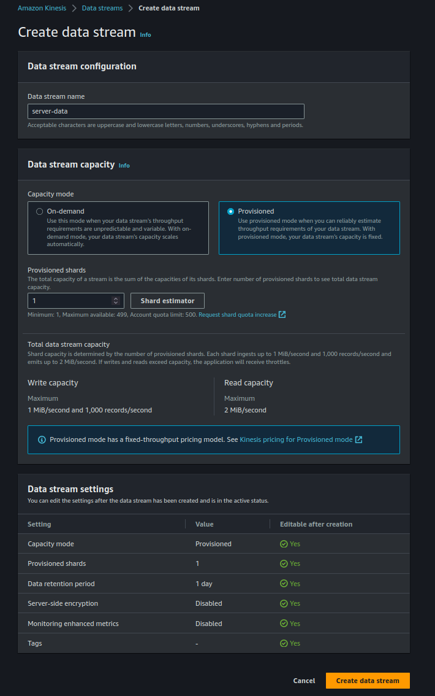
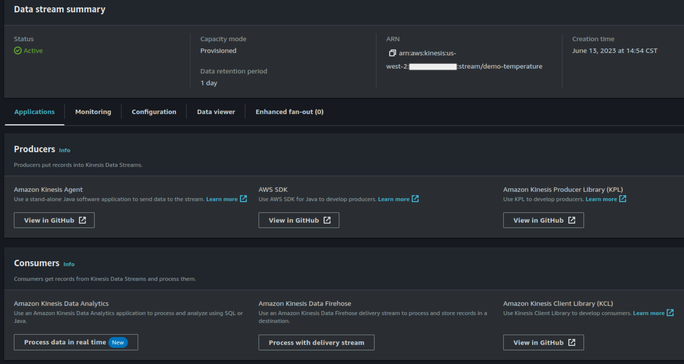
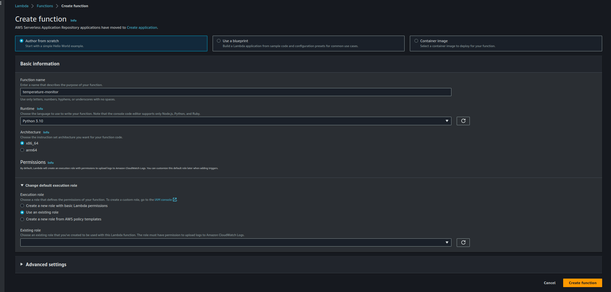
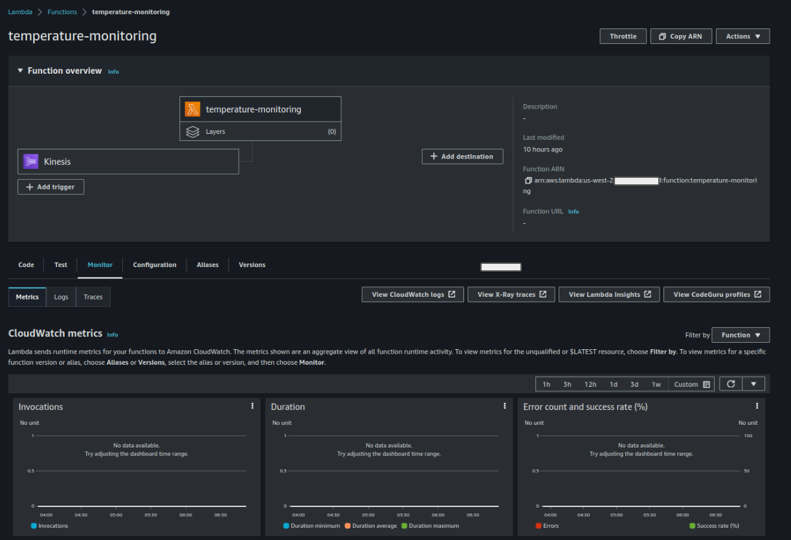

# Lambda Kinesis Demo

In this project we want to demostrate how to use a lambda function to process streaming data. Our streaming data could be from any aource including streaming log from a server or IOT device. Let's pretent that we have server and we are monitoring the temperature as we train a deep learning model.

## Step 1. Setup Streaming Data

To get such data streaming we need a kinesis sevice in AWS. We start by creating a sevice called _server-data_ via _Amazon Kinesis -> Data streams -> Create data stream_. The following is what I had.

To get streaming data from our server, we will use simulated data. A script is provided to generate data. Ensure you have the proper requirement which involes

- Setting the python environment and install all the requirements
- Configuring AWS credentials. This can be done by directly adding the access key and id or using the a profile configure via `aws configure --profile`.

We don't need to start generating data until we configure the consumer of the streaming data, this case out lambda function.

## Step 2. Setup Consumer

Our consumer is a lambda function. Go to lambda functions and create a function called `temperature-monitor`, select python 3.10 and select _Use an existing role_. Here is what my console looks like.

### 1. Provide Consumer with Roles

Actually, we don'y have a role yet. Open a new AWS IAM window and go to roles. Create a role and select _AWS Service -> Lamnda_, next, search for _AWSLambdaKinesisExecutionRole_, select next and name the policy as _lambda-kinesis-role_.

### 2. Setup Lambda

After creating this role, go back to the other window and select the role from the dropdown window and attached to the lambda function. Now the lambda function can read from Kinesis. But we also need to add a trigger.

### 3. Event Trigger

So that the lambda function can be triggered to read from Kinesis. Go to the lambda function page and click on 'Add trigger'. Select 'Kinesis'. On the window provided select select _server-data_ in the Kinesis stream. You can reduce the batch size to 10. This represents the number of events the lambda can pull. We also leave the 'starting position' to latest so that only latest data is processed. You can decided to continually preocess the data by selecting a trip or even specifying the time. Select 5s for batch window. Finish and you are good to go. Here is what mine looked like.

## Step 3. Generate Events

Next generate the streaming data via
`python stream_source.py`. The events are pushed to the kinesis stream.

Watch the incoming data in the Monitor page of the lambda function. Select 'Monitor' and view in cloudWatch logs. Click the log for the labda function and see the output.
